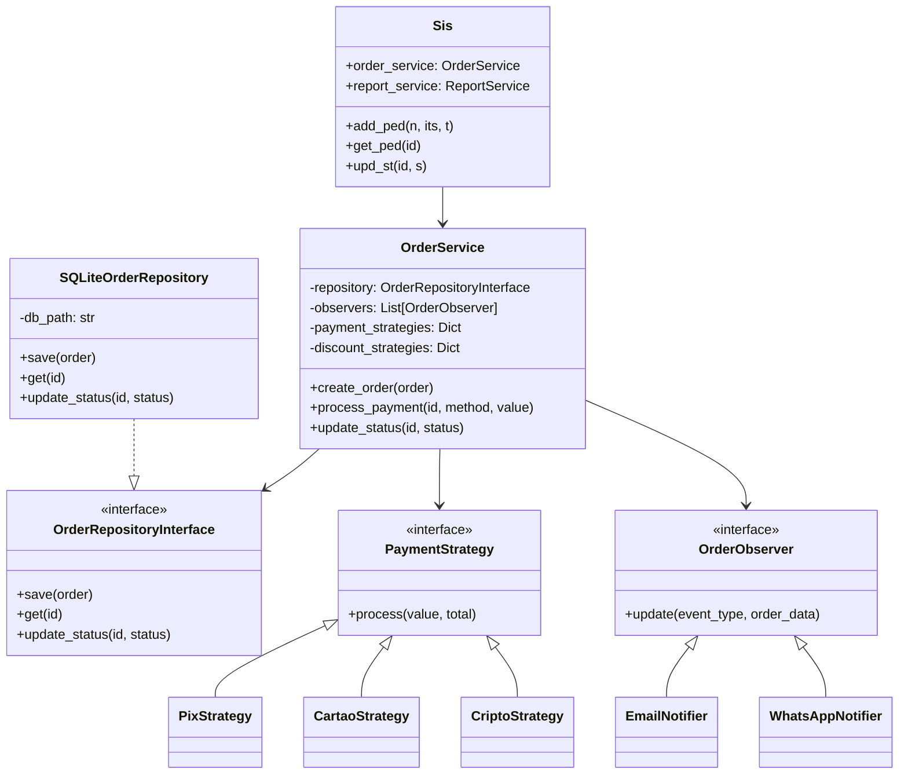

# Documento de Análise e Refatoração

## 8.1 (a) Identificação das Violações SOLID
No código original (`codigo_legado.py`), identificamos várias violações graves dos princípios SOLID:

*   **SRP (Single Responsibility Principle):** A classe `Sis` era um clássico "God Object". Ela gerenciava a conexão com o banco de dados SQLite, montava queries SQL, calculava os descontos de diferentes itens, validava pagamentos simulados e imprimia os relatórios e notificações.
    *   *Trecho problemático:* `def add_ped(self, n, its, t):` fazia inserts diretos no banco e enviava emails na mesma função.
*   **OCP (Open/Closed Principle):** Para adicionar uma nova regra de pagamento ou desconto, era obrigatório modificar a função base.
    *   *Trecho problemático:* Em `upd_st(self, id, s)` haviam múltiplos `if/elif` estáticos verificando `if t == 'vip'`, `elif t == 'corporativo'`, impedindo a extensão sem modificação do código central.
*   **LSP (Liskov Substitution Principle):** A classe `PedEspecial` herdava de `Sis`, mas sobrescrevia o comportamento de `upd_st` e `add_ped`, quebrando as pré-condições da superclasse (retornando e ignorando parâmetros).
    *   *Trecho problem√°tico:* `class PedEspecial(Sis): def upd_st(self, id, s): ...`
*   **ISP (Interface Segregation Principle):** O acesso a dados não possuía uma interface definida; os serviços conheciam e dependiam diretamente do SQL cru, não havendo abstração.
*   **DIP (Dependency Inversion Principle):** Os serviços de alto nível dependiam diretamente dos detalhes de baixo nível (ex: a classe `Sis` manipulava o SQLite diretamente e estava acoplada aos `prints` e regras concretas).

## 8.2 (b) Soluções Implementadas
Para resolver essas violações de SRP, ISP e DIP (foco do Sprint 1), estruturamos as seguintes soluções:

*   **SRP Resolvido:** Criamos o pacote `services/` com o `OrderService` (gestão de pedidos) e o `ReportService` (geração de relatórios). Persistência de dados foi movida para `SQLiteOrderRepository`.
*   **ISP Resolvido:** Criamos a interface `OrderRepositoryInterface` definindo contratos específicos (`save`, `get`, `update_status`, etc.). As classes concretas são obrigadas a implementar apenas os métodos de persistência.
*   **DIP Resolvido:** O `OrderService` parou de instanciar o banco de dados. Agora ele recebe o `OrderRepositoryInterface` via construtor (Injeção de Dependências). Da mesma forma, as lógicas de desconto e pagamento foram passadas via injeção (`payment_strategies`, `item_strategies`).

## 8.3 (c) Diagrama UML de Classes

## 8.4 (d) Melhorias de Clean Code
*   **Nomenclatura:** Variáveis obscuras como `n`, `its`, `t`, `tot` e `st` foram substituídas por nomes descritivos (`cliente`, `itens`, `tipo_pedido`, `total`, `status`). 
*   **Complexidade Ciclomática:** A extração dos blocos gigantes `if/elif/else` para o padrão *Strategy* e *Observer* fragmentou as responsabilidades, diminuindo radicalmente a complexidade das funções centrais (que antes chegavam a ter 5 ou 6 ramificações profundas).
*   **Magic Strings/Numbers:** Substituídos por constantes ou comportamentos delegados nas subclasses (os descontos "20%", "10%" e o valor "1.5" do VIP viraram propriedades isoladas).

## 8.5 (e) Extensões Implementadas
Para provar que o OCP foi satisfeito, as três extensões obrigatórias foram adicionadas ao projeto **sem tocar no código existente do pacote `src/`**:

1.  **Pagamento em Criptomoeda:** Criada a classe `CriptoStrategy` (implementando `PaymentStrategy`) que avalia a cobrança de 2% (verificando se o `value` fornecido atinge `total * 1.02`). Ela foi injetada no dicionário da raiz (`legacy.py`).
2.  **Canal WhatsApp:** Criada a classe `WhatsAppNotifier` implementando a interface `OrderObserver`. Sem modificar o `OrderService`, o notifier foi injetado (via `attach()`) e começou a captar os eventos de `created` e `status_updated`.
3.  **Desconto Progressivo por Volume:** Em vez de mudar a interface de `ItemDiscountStrategy` ou modificar o `OrderService`, aplicamos o padrão *Decorator* com o `VolumeDiscountDecorator`. Ele "envelopa" qualquer estratégia já existente (como `NormalItemStrategy`) e aplica um desconto extra de 15% caso `quantidade >= 3`.

## 8.6 (f) Reflex√£o Metacognitiva
O maior desafio encontrado no processo de refatoração foi desvincular a lógica de notificação (que misturava regras de envio de e-mails, com cálculos de pontuação baseados no status e tipo VIP/Corporativo) de dentro do `OrderService`. A solução para esse alto acoplamento foi o padrão **Observer**, transformando o OrderService em um "publisher" agnóstico, o que permitiu que cada notificador avaliasse as informações recebidas independentemente. Isso trouxe um enorme alívio na legibilidade e facilitou imensamente a adição posterior do `WhatsAppNotifier`.

## 8.7 SaÌda dos Testes e MÈtricas Autom·ticas

### Cobertura de Testes (pytest + coverage)
`	ext
============================= test session starts =============================
platform win32 -- Python 3.13.1, pytest-9.0.3, pluggy-1.6.0
rootdir: C:\projetos\Refatoracao-Limpa
configfile: pytest.ini
plugins: anyio-4.13.0, dash-4.1.0, cov-7.1.0
collected 22 items

tests\test_extensions.py ...                                             [ 13%]
tests\test_legacy_behavior.py ...................                        [100%]

=============================== tests coverage ================================
_______________ coverage: platform win32, python 3.13.1-final-0 _______________

Name                                           Stmts   Miss  Cover
------------------------------------------------------------------
legacy.py                                         52      2    96%
src\__init__.py                                    0      0   100%
src\interfaces\__init__.py                         0      0   100%
src\interfaces\order_repository_interface.py      25      7    72%
src\models\__init__.py                             0      0   100%
src\models\item.py                                 8      1    88%
src\models\order.py                               14      0   100%
src\models\order_factory.py                       10      0   100%
src\observers\notification_observer.py            55      2    96%
src\observers\whatsapp_notifier.py                12      0   100%
src\repositories\__init__.py                       0      0   100%
src\repositories\sqlite_order_repository.py       43      0   100%
src\services\__init__.py                           0      0   100%
src\services\order_service.py                     64      4    94%
src\services\report_service.py                    26      0   100%
src\strategies\crypto_strategy.py                 11      0   100%
src\strategies\discount_strategy.py               33      2    94%
src\strategies\payment_strategy.py                30      5    83%
src\strategies\volume_discount_strategy.py         9      0   100%
------------------------------------------------------------------
TOTAL                                            392     23    94%
============================= 22 passed in 0.36s ==============================

`

### An·lise de Tipagem (Mypy)
`	ext
Success: no issues found in 18 source files

`

### Qualidade de CÛdigo (Lint com Ruff)
`	ext
All checks passed!

`

### Complexidade Ciclom·tica (Radon CC)
`	ext
src\interfaces\order_repository_interface.py
    C 5:0 OrderRepositoryInterface - A (2)
    M 7:4 OrderRepositoryInterface.save - A (1)
    M 11:4 OrderRepositoryInterface.get - A (1)
    M 15:4 OrderRepositoryInterface.update_status - A (1)
    M 19:4 OrderRepositoryInterface.get_all - A (1)
    M 23:4 OrderRepositoryInterface.get_all_clients_and_types - A (1)
    M 27:4 OrderRepositoryInterface.get_total_by_client - A (1)
    M 31:4 OrderRepositoryInterface.close - A (1)
src\models\item.py
    C 1:0 Item - A (2)
    M 2:4 Item.__init__ - A (1)
    M 8:4 Item.get_subtotal_base - A (1)
src\models\order.py
    C 5:0 Order - A (2)
    M 6:4 Order.__init__ - A (1)
    M 15:4 Order.add_item - A (1)
src\models\order_factory.py
    C 5:0 OrderFactory - A (3)
    M 7:4 OrderFactory.create - A (2)
src\observers\notification_observer.py
    C 9:0 EmailNotifier - B (9)
    M 10:4 EmailNotifier.update - B (8)
    C 44:0 PointsNotifier - B (7)
    C 29:0 SMSNotifier - B (6)
    M 45:4 PointsNotifier.update - B (6)
    M 30:4 SMSNotifier.update - A (5)
    C 39:0 AccountManagerNotifier - A (4)
    C 59:0 EspecialNotifier - A (4)
    M 40:4 AccountManagerNotifier.update - A (3)
    M 60:4 EspecialNotifier.update - A (3)
    C 4:0 OrderObserver - A (2)
    M 6:4 OrderObserver.update - A (1)
src\observers\whatsapp_notifier.py
    C 4:0 WhatsAppNotifier - B (6)
    M 5:4 WhatsAppNotifier.update - A (5)
src\repositories\sqlite_order_repository.py
    M 16:4 SQLiteOrderRepository.save - A (3)
    C 7:0 SQLiteOrderRepository - A (2)
    M 26:4 SQLiteOrderRepository.get - A (2)
    M 50:4 SQLiteOrderRepository.get_total_by_client - A (2)
    M 8:4 SQLiteOrderRepository.__init__ - A (1)
    M 38:4 SQLiteOrderRepository.update_status - A (1)
    M 42:4 SQLiteOrderRepository.get_all - A (1)
    M 46:4 SQLiteOrderRepository.get_all_clients_and_types - A (1)
    M 58:4 SQLiteOrderRepository.close - A (1)
src\services\order_service.py
    M 43:4 OrderService.process_payment - A (5)
    M 7:4 OrderService.__init__ - A (4)
    M 21:4 OrderService.calculate_total - A (4)
    M 68:4 OrderService.validate_stock - A (4)
    C 6:0 OrderService - A (3)
    M 17:4 OrderService._notify - A (2)
    M 58:4 OrderService.update_status - A (2)
    M 14:4 OrderService.attach - A (1)
    M 35:4 OrderService.create_order - A (1)
    M 79:4 OrderService.cancel_order - A (1)
src\services\report_service.py
    C 3:0 ReportService - A (3)
    M 20:4 ReportService.generate_clients_report - A (3)
    M 7:4 ReportService.generate_sales_report - A (2)
    M 4:4 ReportService.__init__ - A (1)
src\strategies\crypto_strategy.py
    C 4:0 CriptoStrategy - A (3)
    M 5:4 CriptoStrategy.process - A (2)
src\strategies\discount_strategy.py
    C 3:0 ItemDiscountStrategy - A (2)
    C 8:0 NormalItemStrategy - A (2)
    C 12:0 Desc10ItemStrategy - A (2)
    C 16:0 Desc20ItemStrategy - A (2)
    C 20:0 FreteGratisItemStrategy - A (2)
    C 24:0 OrderDiscountStrategy - A (2)
    C 29:0 NormalOrderStrategy - A (2)
    C 33:0 VipOrderStrategy - A (2)
    C 37:0 CorpOrderStrategy - A (2)
    C 41:0 EspecialOrderStrategy - A (2)
    M 5:4 ItemDiscountStrategy.calculate - A (1)
    M 9:4 NormalItemStrategy.calculate - A (1)
    M 13:4 Desc10ItemStrategy.calculate - A (1)
    M 17:4 Desc20ItemStrategy.calculate - A (1)
    M 21:4 FreteGratisItemStrategy.calculate - A (1)
    M 26:4 OrderDiscountStrategy.calculate - A (1)
    M 30:4 NormalOrderStrategy.calculate - A (1)
    M 34:4 VipOrderStrategy.calculate - A (1)
    M 38:4 CorpOrderStrategy.calculate - A (1)
    M 42:4 EspecialOrderStrategy.calculate - A (1)
src\strategies\payment_strategy.py
    C 9:0 CartaoStrategy - A (3)
    C 18:0 PixStrategy - A (3)
    C 27:0 BoletoStrategy - A (3)
    C 4:0 PaymentStrategy - A (2)
    M 10:4 CartaoStrategy.process - A (2)
    M 19:4 PixStrategy.process - A (2)
    M 28:4 BoletoStrategy.process - A (2)
    M 6:4 PaymentStrategy.process - A (1)
src\strategies\volume_discount_strategy.py
    C 3:0 VolumeDiscountDecorator - A (3)
    M 7:4 VolumeDiscountDecorator.calculate - A (2)
    M 4:4 VolumeDiscountDecorator.__init__ - A (1)

86 blocks (classes, functions, methods) analyzed.
Average complexity: A (2.3255813953488373)

`

### Linhas por MÈtodo (Radon Raw)
`	ext
src\__init__.py
    LOC: 1
    LLOC: 0
    SLOC: 0
    Comments: 1
    Single comments: 1
    Multi: 0
    Blank: 0
    - Comment Stats
        (C % L): 100%
        (C % S): 100%
        (C + M % L): 100%
src\interfaces\order_repository_interface.py
    LOC: 32
    LLOC: 25
    SLOC: 25
    Comments: 0
    Single comments: 0
    Multi: 0
    Blank: 7
    - Comment Stats
        (C % L): 0%
        (C % S): 0%
        (C + M % L): 0%
src\interfaces\__init__.py
    LOC: 1
    LLOC: 0
    SLOC: 0
    Comments: 1
    Single comments: 1
    Multi: 0
    Blank: 0
    - Comment Stats
        (C % L): 100%
        (C % S): 100%
        (C + M % L): 100%
src\models\item.py
    LOC: 9
    LLOC: 12
    SLOC: 8
    Comments: 0
    Single comments: 0
    Multi: 0
    Blank: 1
    - Comment Stats
        (C % L): 0%
        (C % S): 0%
        (C + M % L): 0%
src\models\order.py
    LOC: 16
    LLOC: 21
    SLOC: 14
    Comments: 0
    Single comments: 0
    Multi: 0
    Blank: 2
    - Comment Stats
        (C % L): 0%
        (C % S): 0%
        (C + M % L): 0%
src\models\order_factory.py
    LOC: 11
    LLOC: 10
    SLOC: 10
    Comments: 0
    Single comments: 0
    Multi: 0
    Blank: 1
    - Comment Stats
        (C % L): 0%
        (C % S): 0%
        (C + M % L): 0%
src\models\__init__.py
    LOC: 1
    LLOC: 0
    SLOC: 0
    Comments: 1
    Single comments: 1
    Multi: 0
    Blank: 0
    - Comment Stats
        (C % L): 100%
        (C % S): 100%
        (C + M % L): 100%
src\observers\notification_observer.py
    LOC: 62
    LLOC: 56
    SLOC: 56
    Comments: 0
    Single comments: 0
    Multi: 0
    Blank: 6
    - Comment Stats
        (C % L): 0%
        (C % S): 0%
        (C + M % L): 0%
src\observers\whatsapp_notifier.py
    LOC: 13
    LLOC: 12
    SLOC: 12
    Comments: 0
    Single comments: 0
    Multi: 0
    Blank: 1
    - Comment Stats
        (C % L): 0%
        (C % S): 0%
        (C + M % L): 0%
src\repositories\sqlite_order_repository.py
    LOC: 59
    LLOC: 45
    SLOC: 47
    Comments: 4
    Single comments: 4
    Multi: 0
    Blank: 8
    - Comment Stats
        (C % L): 7%
        (C % S): 9%
        (C + M % L): 7%
src\repositories\__init__.py
    LOC: 1
    LLOC: 0
    SLOC: 0
    Comments: 1
    Single comments: 1
    Multi: 0
    Blank: 0
    - Comment Stats
        (C % L): 100%
        (C % S): 100%
        (C + M % L): 100%
src\services\order_service.py
    LOC: 81
    LLOC: 68
    SLOC: 65
    Comments: 0
    Single comments: 0
    Multi: 0
    Blank: 16
    - Comment Stats
        (C % L): 0%
        (C % S): 0%
        (C + M % L): 0%
src\services\report_service.py
    LOC: 30
    LLOC: 28
    SLOC: 25
    Comments: 2
    Single comments: 2
    Multi: 0
    Blank: 3
    - Comment Stats
        (C % L): 7%
        (C % S): 8%
        (C + M % L): 7%
src\services\__init__.py
    LOC: 1
    LLOC: 0
    SLOC: 0
    Comments: 1
    Single comments: 1
    Multi: 0
    Blank: 0
    - Comment Stats
        (C % L): 100%
        (C % S): 100%
        (C + M % L): 100%
src\strategies\crypto_strategy.py
    LOC: 12
    LLOC: 11
    SLOC: 11
    Comments: 0
    Single comments: 0
    Multi: 0
    Blank: 1
    - Comment Stats
        (C % L): 0%
        (C % S): 0%
        (C + M % L): 0%
src\strategies\discount_strategy.py
    LOC: 43
    LLOC: 33
    SLOC: 33
    Comments: 0
    Single comments: 0
    Multi: 0
    Blank: 10
    - Comment Stats
        (C % L): 0%
        (C % S): 0%
        (C + M % L): 0%
src\strategies\payment_strategy.py
    LOC: 34
    LLOC: 30
    SLOC: 30
    Comments: 0
    Single comments: 0
    Multi: 0
    Blank: 4
    - Comment Stats
        (C % L): 0%
        (C % S): 0%
        (C + M % L): 0%
src\strategies\volume_discount_strategy.py
    LOC: 11
    LLOC: 9
    SLOC: 9
    Comments: 0
    Single comments: 0
    Multi: 0
    Blank: 2
    - Comment Stats
        (C % L): 0%
        (C % S): 0%
        (C + M % L): 0%

`
